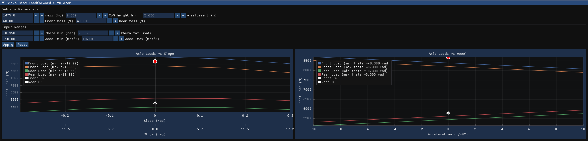

# Vehicle Axle Load Simulator

Interactive ImGui/ImPlot app to visualize front/rear axle loads vs. road slope and vehicle acceleration using a simple quasi‑static model. Includes operating point markers and editable vehicle/range inputs.

## Features
- Two plots shown side‑by‑side in one row:
  - Axle Loads vs Slope (x in radians, secondary top axis in degrees)
  - Axle Loads vs Acceleration (x in m/s²)
- Front and rear traces for min/max slices (accel for slope plot, slope for accel plot)
- Operating point markers for front and rear
- Editable inputs above plots:
  - Vehicle: mass (kg), CoG height h (m), wheelbase L (m)
  - Static mass distribution: Front mass (%) and Rear mass (%)
  - Apply and Reset buttons (Reset restores initial defaults)


## Project Files
- `main.cpp` – main app & UI
- `plots.hpp` / `plots.cpp` – plotting UI (ImGui/ImPlot)
- `axleLoads.hpp` / `axleLoads.cpp` – vehicle params, model, grid generation, nominal loads
- `devTools/` – vendored ImGui/ImPlot and backends


## Build
Prerequisites: CMake (>=3.10), a C++17 compiler, OpenGL + GLFW. ImGui/ImPlot are included under `devTools/`.

### If building for the first time, from the build folder, execute -> cmake ..
### From repo root, run: `./build.sh`
### This configures CMake into `./build` and builds the app.

### macOS/Linux
cd build
cmake ..
../build.sh

## Run
### macOS/Linux from repo root dir:
```
./build/WheelLoadDistributor
```

On macOS you may see OpenGL deprecation warnings; they can be ignored.

### Windows (if using MinGW/GLFW there)
Executable name `WheelLoadDistributor` in `build/`.


## Model Overview

For slope θ and longitudinal acceleration a:

- Total normal load: W = m·g·cos(θ)
- Static split: Wf0 = W·(lr/L), Wr0 = W·(lf/L)
- Longitudinal transfer: ΔW = m·h/L·(a + g·sin(θ))
- Front/Rear: Wf = Wf0 − ΔW, Wr = Wr0 + ΔW

Operating point (θ_nom, a_nom) is computed with the same equations and plotted on both charts.

## User Interface/Controls
- Edit vehicle parameters and ranges at the top.
- Click Apply to recompute plots and operating point.
- Click Reset to restore default inputs (then Apply to recompute).
- The slope plot shows a secondary top x‑axis in degrees aligned with the primary radians axis.

